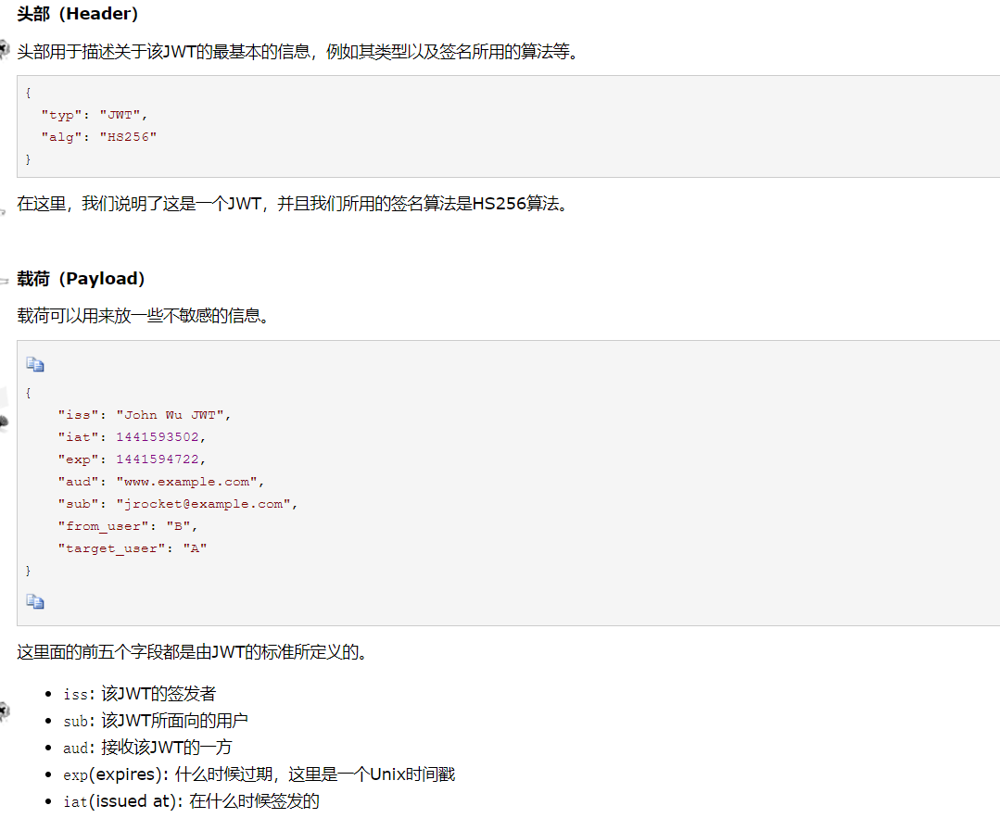
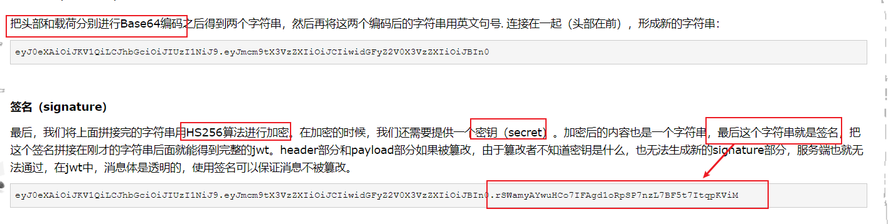
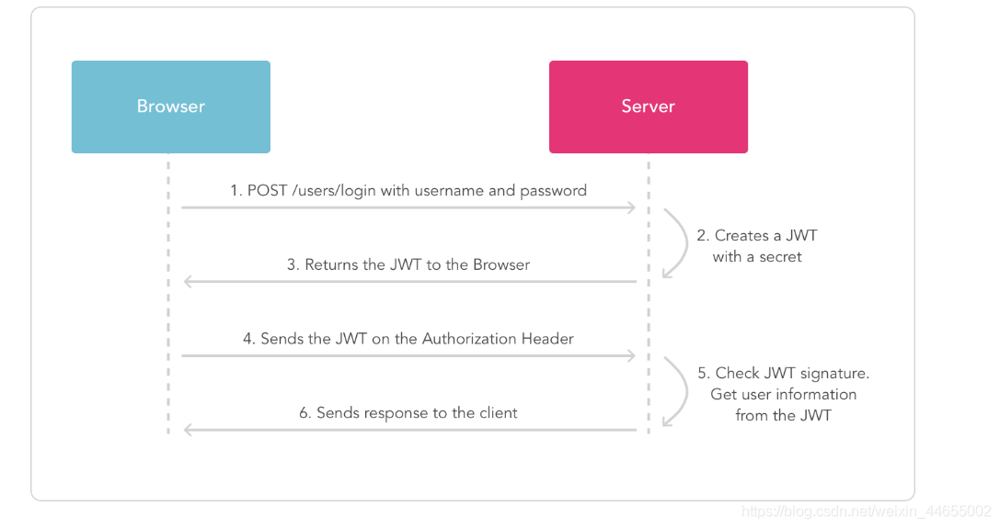

# cookie、session和JWT（JSON Web Token）的区别

## cookie是什么
&emsp;&emsp;http无状态协议，客户端与服务器进行会话，不会保留会话信息，如果需要跟踪访问者的身份信息，需要将会话状态进行保存，这需要通过卫华cookie或者session来做到。

### cookie的设置:
* 客户端发送 HTTP 请求到服务器;
* 当服务器收到 HTTP 请求时，在响应头里面添加一个 Set-Cookie 字段
浏览器收到响应后保存下 Cookie;
* 之后对该服务器每一次请求中都通过 Cookie 字段将 Cookie 信息发送给服务器。

### cookie的一些相关属性

* Name/Value
> 用 JavaScript 操作 Cookie 的时候注意对 Value 进行编码处理。

* Expires/Max-age
>1、Expires 用于设置 Cookie 的过期时间。比如:
> ```http
> Set-Cookie: id=aad3fWa; Expires=Wed, 21 May 2020 07:28:00 GMT;
> ```
> * 当 Expires 属性缺省时，表示是会话性 Cookie。
>* Expires 的值为 Session，表示的就是会话性 Cookie。
>* 会话性 Cookie 的时候，值保存在客户端内存中，并在用户关闭浏览器时失效。
> * 需要注意的是，有些浏览器提供了会话恢复功能，关闭浏览器，会话期Cookie会保留下来。
> * 与会话性 Cookie 相对的是持久性 Cookie，持久性 Cookies 会保存在用户的硬盘中，直至过期或者清除 Cookie。
> 2、Max-Age 用于设置在 Cookie 失效之前需要经过的秒数。比如：
>  ```http
> Set-Cookie: id=a3fWa; Max-Age=604800;
> ```
> 假如 Expires 和 Max-Age 都存在，Max-Age 优先级更高。


* Domain
> omain 指定了 Cookie 可以送达的主机名。假如没有指定，那么默认值为当前文档访问地址中的主机部分（但是不包含子域名）。
> 在这里注意的是，不能跨域设置 Cookie

* Path
> Path 指定了一个 URL 路径，这个路径必须出现在要请求的资源的路径中才可以发送 Cookie 首部。比如设置 Path=/docs，/docs/Web/ 下的资源会带 Cookie 首部，/test 则不会携带 Cookie 首部。
> 
_「Domain 和 Path 标识共同定义了 Cookie 的作用域：即 Cookie 应该发送给哪些 URL。」_
* Secure属性
 >标记为 Secure 的 Cookie 只应通过被HTTPS协议加密过的请求发送给服务端。使用 HTTPS 安全协议，可以保护 Cookie 在浏览器和 Web 服务器间的传输过程中不被窃取和篡改。

 * HTTPOnly
  >设置 HTTPOnly 属性可以防止客户端脚本通过 document.cookie 等方式访问 Cookie，有助于避免 XSS 攻击。
* SameSite
 > SameSite 属性可以让 Cookie 在跨站请求时不会被发送，从而可以阻止跨站请求伪造攻击（CSRF）。

### cookie的作用
1. 会话状态管理（如用户登录状态、购物车、游戏分数或其它需要记录的信息）
2. 个性化设置（如用户自定义设置、主题等）
3. 浏览器行为跟踪（如跟踪分析用户行为等）

## session是什么
&emsp;&emsp;另一种记录客户端和服务器会话状态的一种机制。session基于cookie实现，session是存储在服务器端，sessionid是存储到客户端cookie中。

流程：
* 第一次请求服务器，服务器根据提交的信息创建session；
* 请求返回将Session的唯一标识Sessionid返回给浏览器（set-cookie）
* 浏览器接收到Session信息后，会将该信息存入Cookie中，同时记录Cookie此SessionID属于哪个域名
* 第二次请求服务器时，查看该域名下是否存在Cookie，存在Cookie自动也将其信息发送给服务器，服务器从Cookie中找到SessionID,再根据SessionId查找对应的Session信息，如果没有就是没有登陆或者登陆失效，如果找到就可以继续操作。


## 对JWT（JSON Web Token）的理解
**如下图：**



### 如何使用
> 一般是在请求头里加入Authorization，并加上Bearer标注：
> ```javascript
>fetch(‘api/user/1’, {
> headers: {
>‘Authorization’: 'Bearer ’ + token
>}
>})
> ```

服务端会验证token，如果验证通过就会返回相应的资源。整个流程就是这样的:



## 区别

### cookie和session：

1. cokie数据一般放在客户端，session数据放在服务端
2. cookie不安全，会被攻击
3. session存在服务器，安全。


### jwt和session的区别

1. jwt是保存在客户端，而session是保存在服务端

2. jwt使用base64编码将头部信息和载荷信息进行编码形成一个字符串，然后再使用hs256算法，将这个字符串记性加密，形成一个签名，把签名加在这个字符串的后面。
就是token了。