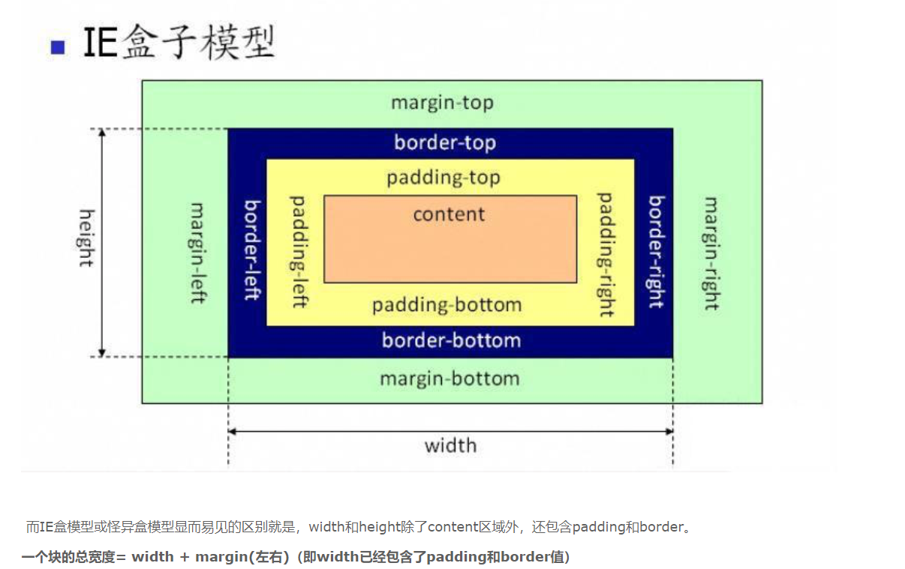
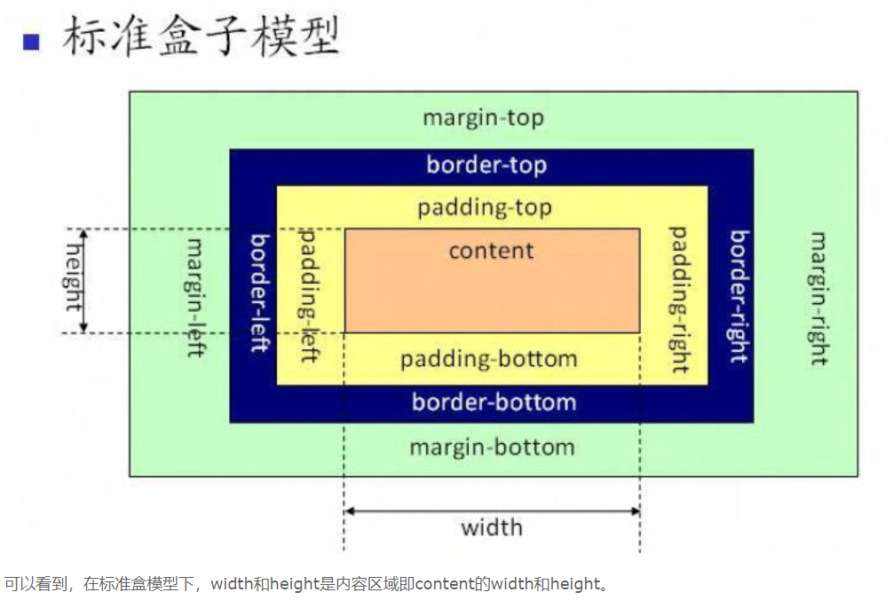

# css盒子模型

## 盒子中的区域
一个盒子中主要的属性就5个：width、height、padding、border、margin。如下：
* width和height：内容的宽度、高度（不是盒子的宽度、高度）
* padding: 内边距
* boder：边框
* margin：外边距

## IE盒子模型

## 标准盒子模型

## 两者的区别

> &emsp;&emsp; 标准模式：box-sizing:content-box;
标准模式盒子宽度会被设置的padding撑开，所设置的width为内容宽度（content）。
标准模式盒子总宽度/高度：内容区宽度 /高度+padding+border + margin。

>&emsp;&emsp;IE（怪异）盒子模型：box-sizing:border-box; 不会被padding撑开。
怪异模式则相当于将盒子的大小固定好，再将内容装入盒子。盒子的大小并不会被padding所撑开。怪异模式盒子总宽度/高度： width/height + margin 