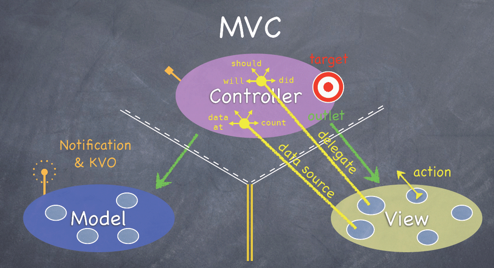

# **MVVM 模式的理解**

## **一、什么是MVVM(Model-View-ViewModel)模式**
&emsp;&emsp; 是一种软件架构设计模式。是一种简化用户界面的事件驱动编程方式。MVVVM的核心是ViewModel层，负责转换Model中的数据对象让数据变得更容易管理和使用。

**ViewModel的主要作用是：**
* 向上与视图层进行双向数据绑定
* 向下与Model层通过接口请求进行数据交互。
  
_当下的MVVM模式的前端框架有Vie.js,Angularjs等等_

## **二、为什么要使用MVVM框架。**

**1. MVVM模式和MVC模式一样，主要的目的是分离视图（View）和模型（Model），可以解决前端开发的一些痛点：**

*  开发者在代码中大量调用相同的DOM API,处理繁琐，操作冗余，使得代码难以维护。
* 大量的DOM操作，导致页面渲染性能下降，加载速度慢，影响用户体验。
* 当model频繁更新的时候，开发者需要手动将数据更新到view上面；当用户的操作导致Model发生变化时候，开发者也需要将数据同步到Model中，这样的工作不仅繁琐，而且很难维护复杂多变数据状态。
>其实，早期jquery 的出现就是为了前端能更简洁的操作DOM 而设计的，但它只解决了第一个问题，另外两个问题始终伴随着前端一直存在。

**2. 低耦合：** 视图（View）可以独立于 Model 变化和修改，一个 ViewModel 可以绑定到不同的 View 上，当 View 变化的时候 Model 可以不变，当 Model 变化的时候 View 也可以不变。

**3. 可复用：** 你可以把一些视图逻辑放在一个 ViewModel 里面，让很多 View 重用这段视图逻辑。

**4. 独立开发：** 开发人员可以专注于业务逻辑和数据的开发（ViewModel），设计人员可以专注于页面设计。

**5. 可测试：** 界面素来是比较难于测试的，而现在测试可以针对 ViewModel 来写。

## **三、MVVM的组成**：

1. View：View是视图层，也是用户界面层。前端主要有HTML和css来构建。用来展示数据。
2. Model：指的是数据模型，泛指后端进行的各种业务逻辑处理和数据操控，主要围绕数据库系统展开。这里的难点只要在于需要和前端约定统一的接口规范。
3. VIewModel：是由前端开发人员维护的视图数据层，这一层，前端开发者对从后端获取过来的数据进行转换处理和二次封装，生成符合View层使用预期的视图数据模型。需要注意的是 ViewModel 所封装出来的数据模型包括视图的状态和行为两部分，而 Model 层的数据模型是只包含状态的。
> * 比如页面的这一块展示什么，那一块展示什么这些都属于视图状态（展示）
> * 页面加载进来时发生什么，点击这一块发生什么，这一块滚动时发生什么这些都属于视图行为（交互）。

视图的状态和行为都封装在了ViewModel层，这样的封装使得ViewModel可以完整地去描述View层。因为实现了双向绑定，ViewModel的内容会实时地展示在view层，不需要开发者去操作响应的dom元素去更新视图，把主要的精力放在ViewModel的维护和管理上。MVVM中，View层展现的不是Model的数据，而是ViewModel中的数据，由ViewModel负责与Model去交互，这就完全解耦了View层数Model层，这解耦是至关重要的，他是前后端分离的重要环节。

[参考1](https://www.cnblogs.com/goloving/p/8520030.html)
[参考2](https://www.jianshu.com/p/4978e076f5a4)

## 四、MVC（Model-View-controller）

* Model层： 是应用程序中用于处理应用程序数据逻辑的部分。通常模型对象负责在数据库中存取数据。

* View层是应用程序中处理数据显示的部分。通常视图是依据模型数据创建的。

* Controller层：Controller是MVC中的数据和视图的协调者，也就是在Controller里面把Model的数据赋值给View来显示（或者是View接收用户输入的数据然后由Controller把这些数据传给Model来保存到本地或者上传到服务器）。

## 五、MVC和MVVM的区别：

### mvc和mvvm并不是同一个概念，所以说区别很难讲。

 > mvc其实是以前 整个前后端的架构思想，mvvm大多是一个前端框架的设计思想，就比如vue，react这些。这两者其实是没有什么可比性的。

**硬是要说的话，那就：**
1. mvc 中 Controller演变成 mvvm 中的 viewModel
2. mvc中通过大量的dom操作来进行视图的更新，而mvvm中是通过数据驱动来更新视图。解决了 mvc中大量操作dom带来的页面渲染性能降低，加载速度变慢，影响用户体验。
3. mvc中Model和View是可以直接打交道的，造成Model层和View层之间的耦合度高，当和Model频繁发生变化，开发者需要主动更新到View。而mvvm中Model和View不直接交互，而是通过中间桥梁ViewModel来同步更新。

> (MVC是单向通信。也就是View跟Model，必须通过Controller来承上启下。MVC和MVVM的区别并不是VM完全取代了C，只是在MVC的基础上增加了一层VM，只不过是弱化了C的概念，ViewModel存在目的在于抽离Controller中展示的业务逻辑，而不是替代Controller，其它视图操作业务等还是应该放在Controller中实现。也就是说MVVM实现的是业务逻辑组件的重用，使开发更高效，结构更清晰，增加代码的复用性。)

