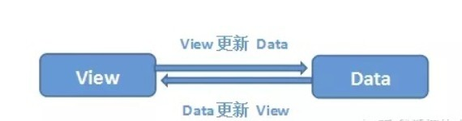
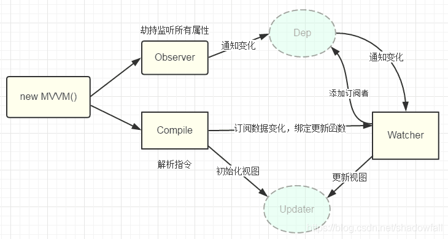
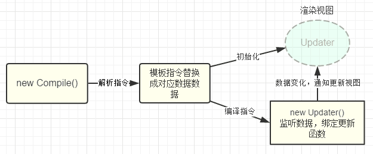
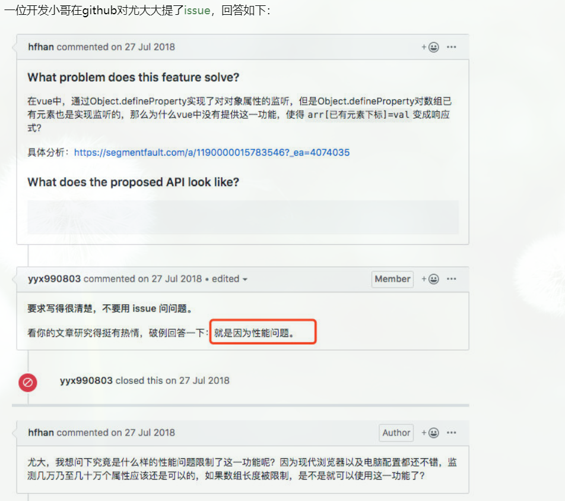
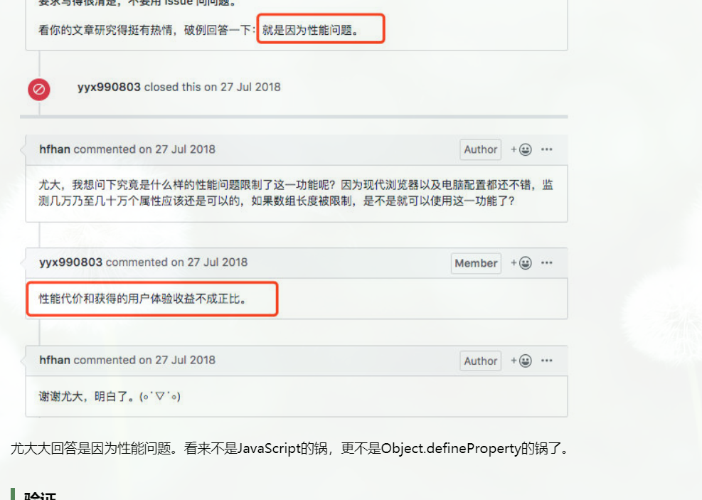

# vue2的响应式原理

## 原理
Vue的响应式原理主要指的是：**数据变化更新视图，视图变化更新数据，如下：**



当修改vue中的数据时，视图就会进行更新。需要做到这一点，vue需要做这样的事情：
* 监听数据的变化
* 收集视图依赖了那些数据
* 当数据变化的时候，通知需要更新的试图进行更新
  
专业点就是：
* 数据劫持/代理
* 收集依赖
* 发布订阅模式

实现的核心是通过Object.defineProperty()来对data的每个属性进行getter和setter的拦截。整个流程如下：




### 一、首先，需要一个监听器Observe。
&emsp;&emsp;对数据对象进行 遍历，包括子属性对象的属性，利用Object.defineProperty()对属性都加上setter和getter。这样的话，给这个对象的某个值赋值，就会触发setter，那么就能监听到数据的变化。

&emsp;&emsp;Observe简单实现如下:
```javascript
var data = {name: 'a'};
observe(data);
data.name = 'b'; //监听到值变化了 a --> b

function observe(data) {
    if (!data || typeof data !== 'object') {
        return;
    }
    // 取出所有属性遍历
    Object.keys(data).forEach(function(key) {
        defineReactive(data, key, data[key]);
    });
};

function defineReactive(data, key, val) {
    observe(val); // 监听子属性
    Object.defineProperty(data, key, {
        enumerable: true, // 可枚举
        configurable: false, // 不能再define
        get: function() {
            return val;
        },
        set: function(newVal) {
            console.log('监听到值变化了 ', val, ' --> ', newVal);
            val = newVal;
        }
    });
}

```
&emsp;&emsp;这样我们已经可以监听每个数据的变化了，那么监听到变化之后，需要通知订阅者，所以需要一个消息订阅器<code>Dep</code>，只需要维护一个数组，用来收集订阅者。上面代码改善如下：
```javascript
// ... 省略
function defineReactive(data, key, val) {
    var dep = new Dep();
    observe(val); // 监听子属性

    Object.defineProperty(data, key, {
        // ... 省略
        set: function(newVal) {
            if (val === newVal) return;
            console.log('监听到值变化了 ', val, ' --> ', newVal);
            val = newVal;
            dep.notify(); // 通知所有订阅者
        }
    });
}

function Dep() {
    this.subs = [];
}
Dep.prototype = {
    addSub: function(sub) {
        this.subs.push(sub);
    },
    notify: function() {
        this.subs.forEach(function(sub) {
            sub.update();
        });
    }
};
```

&emsp;&emsp;那么，要怎么往订阅器里面添加订阅者<code>watcher</code>呢？
&emsp;&emsp;那么就需要在defineReactive里面的getter进行操作了。代码如下：

```javascript

// Observer.js
// ...省略
Object.defineProperty(data, key, {
    get: function() {
        // 由于需要在闭包内添加watcher，所以通过Dep定义一个全局target属性，暂存watcher, 添加完移除
        Dep.target && dep.addSub(Dep.target);
        return val;
    }
    // ... 省略
});

// Watcher.js
Watcher.prototype = {
    get: function(key) {
        Dep.target = this;
        this.value = data[key];    // 这里会触发属性的getter，从而添加订阅者
        Dep.target = null;
    }
}
```

### 二、Compile
&emsp;&emsp;解析 Vue 模板指令，将模板中的变量都替换成数据，然后初始化渲染页面视图，并**将每个指令对应的节点绑定更新函数，添加监听数据的订阅者<code>Watcher</code>**，一旦数据有变动，收到通知，调用更新函数进行数据更新。


### 三、订阅者Watcher 
&emsp;&emsp;Watcher订阅者是Observe和Compile之间的通讯桥梁，主要的任务就是：
* 在自身实例化的时候往属性订阅器<code>Dep</code>里面添加自己。
* 自身必须有一个update()方法
* 等待属性dep.notice()通知时，能调用自身的update()方法，触发Compile中绑定的回调。实现视图的更新。
  

## vue从实例化到组件挂载的整个双向绑定的过程如下：

1. 在vue的created阶段，vue内部会执行observe，开始对data的响应式监听，将data属性代理到vm实例上。并且每个属性都会有一个Dep类。
2. 在vue首次渲染的时候，就是在mounted阶段，每个组件都会new一个Watcher的实例，并且会调用组件的render函数，进行页面的渲染。
3. 在首次render页面的时候，这时候就会访问data的一些属性，然后触发getter。这个时候会调用data属性里面的Dep.depend()，进行依赖的收集，将依赖watcher放到一个sub数组里面，完成依赖的收集。
4. 如果数据发生改变，就会触发setter，则会调用内部的dep.notify()，遍历通知sub里面收集的依赖watcher，从而watcher会调用内部的更新函数，进行页面的更新。


## Object.defineproperty的局限性。
1. 无法检测对象属性新增和删除。因为getter/setter方法只能追踪一个数据是否被修改，无法追踪属性被删除和新增。
>解决办法: 
> * 通过vue.set()方法来对对象的属性进行新增或者修改，就可以实现监听了。
> * 给这个对象重新赋值。

2. 无法监听数组的改变。(其实Object.defineproperty，只是vue框架设计在根据到性能与用户体验做了取舍)
>
>
>
>解决：vue的源码中，对数组的一些方法进行了重写，有 push,pop,shift, unshift,sort,reverse, splice，使用这些方法对数组进行操作的话就可以实现响应。
                        
## 扩展
&emsp;&emsp;es6的Proxy(v3.0)，这里就是vue3和vue的响应式部分不一样的地方。

 &emsp;&emsp;Proxy是Javascript 2015的一个新特征。proxy代理的是整个对象，和Object.defineProperty不一样，需要遍历对象的每个属性，Proxy只需要做一层代理就可以监听同级结构下的属性变化，当然对于深层结构，还是需要进行递归。这里Proxy是可以对数组的变化进行监听的。但是Proxy的兼容性不太好。

<p> .</p>
<p> .</p>
<p> .</p>
<p> .</p>
<p> .</p>


_为什么vue2不对数组进行Object.defineProperty:_

[_参考一_](https://www.cnblogs.com/youhong/p/12173354.html)

[_参考二_](https://www.jb51.net/article/171869.htm )

