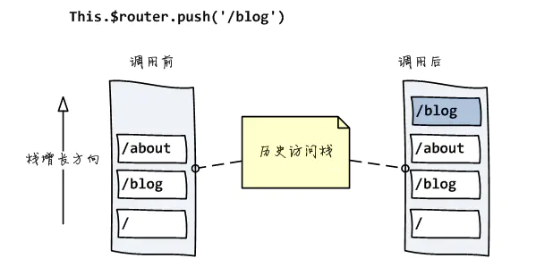
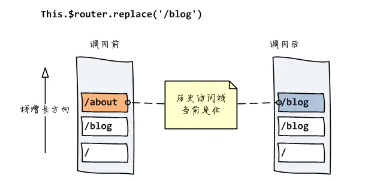

# **vue-router原理**

&emsp;&emsp;大型单页面应用(SPA)最显著特点之一就是采用的前端路由系统，通过改变url，在不重新请求页面的情况下，更新页面视图。
&emsp;&emsp;更新视图但不请求页面，是前端路由原理核心之一，目前在浏览器环境中这一功能的实现主有两种方式：
1. **Hash** --- 利用 URL 中的**hash**("#");
2. 利用 **History interface** 在HTML5中新增的方法。
3. 其实还有一种，abstract，用于非浏览器应用
vue-router是vue框架的路由插件，他是通过**mode**这一参数来控制路由的实现模式的。

## **mode参数模式**
```javascript 
const router = new VueRouter({
  mode: 'history',
  routes: [...]
})
```
1. 创建VueRouter的实例对象时，mode以构造函数参数的形式传入。作为参数传入的字符串属性mode只是一个标记，用来指示实际起作用的对象属性history的实现类，两者对应关系：

```javascript
 modehistory:
        'history':HTML5History;
        'hash':HashHistory;
        'abstract':AbstractHistory;
```

2. 在初始化对应的history之前，会对mode做一些校验：若浏览器不支持HTML5History(通过supportsPushState变量判断)，则mode强制设为‘hash’；若不是在浏览器环境运行的，则mode强制设为‘abstract’

3. VueRouter类中的onReady(), push()等方法只是一个代理，实际是调用的具体history对象的对应方法，在init()方法中初始化时，也是根据history对象具体的类别执行不同操作。

## **hashHistory**
hash（“#”）符号的本来作用是加在URL中指示网页中的位置, '#'
 符号本身以及它后面的字符称之为hash，可通过window.location.hash属性读取。它具有如下特点：
* hash虽然出现在URL中，但不会被包括在HTTP请求中。它是用来指导浏览器动作的，对服务器端完全无用，因此，改变hash不会重新加载页面。
* 可以为hash的改变添加监听事件：
  ```javascript
   window.addEventListener("hashchange", funcRef, false)
  ```

* 每一次改变hash（window.location.hash），都会在浏览器的访问历史中增加一个记录。

&emsp;&emsp;利用以上特点，就可以实现前端路由“更新视图不重新请求页面”的功能。

### **HashHistory.push()**
&emsp;&emsp; **HashHistory.push()** 将新路由添加到浏览器访问历史的栈顶。
 &emsp;&emsp;

 &emsp;&emsp;vue-router源码中HashHistory中的push()方法：
 ```javascript
push (location: RawLocation, onComplete?: Function, onAbort?: Function) {
  this.transitionTo(location, route => {
    pushHash(route.fullPath)
    onComplete && onComplete(route)
  }, onAbort)
}

function pushHash (path) {
  window.location.hash = path
}
 ```

  &emsp;&emsp;transitionTo()方法是父类中定义的是用来处理路由变化中的基础逻辑的，push()方法最主要的是对window的hash进行了直接赋值：

  ```javascript
   window.location.hash = route.fullPath
  ```
  &emsp;&emsp;hash的改变会自动添加到浏览器的访问历史记录中。
那么是怎么样实现视图更新的呢？父类History中transitionTo()方法的这么一段：
```javascript
transitionTo (location: RawLocation, onComplete?: Function, onAbort?: Function) {
  const route = this.router.match(location, this.current)
  this.confirmTransition(route, () => {
    this.updateRoute(route)
    ...
  })
}

updateRoute (route: Route) {
  
  this.cb && this.cb(route)
  
}

listen (cb: Function) {
  this.cb = cb
}
```

  &emsp;&emsp;可以看到，当路由变化时，调用了History中的this.cb方法，而this.cb方法是通过History.listen(cb)进行设置的。回到VueRouter类定义中，找到了在init()方法中对其进行了设置：
```javascript

init (app: any /* Vue component instance */) {
    
  this.apps.push(app)

  history.listen(route => {
    this.apps.forEach((app) => {
      app._route = route
    })
  })
}
```
&emsp;&emsp;根据注释，app为Vue组件实例，但我们知道Vue作为渐进式的前端框架，本身的组件定义中应该是没有有关路由内置属性_route，如果组件中要有这个属性，应该是在插件加载的地方，即VueRouter的install()方法中混合入Vue对象的，查看install.js源码，有如下一段：
```javascript
export function install (Vue) {
  
  Vue.mixin({
    beforeCreate () {
      if (isDef(this.$options.router)) {
        this._router = this.$options.router
        this._router.init(this)
        Vue.util.defineReactive(this, '_route', this._router.history.current)
      }
      registerInstance(this, this)
    },
  })
}
```
&emsp;&emsp;**通过Vue.mixin()方法，全局注册一个混合，影响注册之后所有创建的每个 Vue 实例，该混合在beforeCreate钩子中通过Vue.util.defineReactive()定义了响应式的_route属性。所谓响应式属性，即当_route值改变时，会自动调用Vue实例的render()方法，更新视图。**

总结一下，从设置路由改变到视图更新的流程如下：

```javascript
1 $router.push() //调用方法

2 HashHistory.push() //根据hash模式调用,设置hash并添加到浏览器历史记录（添加到栈顶）（window.location.hash= XXX）

3 History.transitionTo() //监测更新，更新则调用History.updateRoute()

4 History.updateRoute() //更新路由

5 {app._route= route} //替换当前app路由

6 vm.render() //更新视图
```

### **HashHistory.replace()**
&emsp;&emsp;replace()方法不同之处在于，他并不是将新路由添加到浏览器访问历史的栈顶，而是替换掉当前的路由。


```javascript
replace (location: RawLocation, onComplete?: Function, onAbort?: Function) {
  this.transitionTo(location, route => {
    replaceHash(route.fullPath)
    onComplete && onComplete(route)
  }, onAbort)
}
  
function replaceHash (path) {
  const i = window.location.href.indexOf('#')
  window.location.replace(
    window.location.href.slice(0, i >= 0 ? i : 0) + '#' + path
  )
}
```
&emsp;&emsp;可以看出，它与push()的实现结构上基本相似，不同点在于它不是直接对window.location.hash进行赋值，而是调用window.location.replace方法将路由进行替换。

### **监听地址栏**
&emsp;&emsp;以上讨论的VueRouter.push()和VueRouter.replace()是可以在vue组件的逻辑代码中直接调用的，除此之外在浏览器中，用户还可以直接在浏览器地址栏中输入改变路由，因此VueRouter还需要能监听浏览器地址栏中路由的变化，并具有与通过代码调用相同的响应行为。在HashHistory中这一功能通过setupListeners实现：

```javascript
setupListeners () {
  window.addEventListener('hashchange', () => {
    if (!ensureSlash()) {
      return
    }
    this.transitionTo(getHash(), route => {
      replaceHash(route.fullPath)
    })
  })
}
```

&emsp;&emsp;该方法设置监听了浏览器事件hashchange，调用的函数为replaceHash，即在浏览器地址栏中直接输入路由相当于代码调用了replace()方法。

## **HTML5History**

&emsp;&emsp;History interface是浏览器历史记录栈提供的接口，通过back(), forward(), go()等方法，我们可以读取浏览器历史记录栈的信息，进行各种跳转操作。
&emsp;&emsp;从HTML5开始，History interface有进一步修炼：pushState(), replaceState() 这下不仅是读取了，还可以对浏览器历史记录栈进行修改：
```javascript
window.history.pushState(stateObject, title, URL)
window.history.replaceState(stateObject, title, URL)
```

* stateObject: 当浏览器跳转到新的状态时，将触发popState事件，该事件将携带这个stateObject参数的副本

* title: 所添加记录的标题

* URL: 所添加记录的URL

> 这两个方法有个共同的特点：当调用他们修改浏览器历史记录栈后，虽然当前URL改变了，但浏览器不会立即发送请求该URL（the browser won't attempt to load this URL after a call to pushState()），这就为单页应用前端路由“更新视图但不重新请求页面”提供了基础。

vue-router中的源码：
```javascript
push (location: RawLocation, onComplete?: Function, onAbort?: Function) {
  const { current: fromRoute } = this
  this.transitionTo(location, route => {
    pushState(cleanPath(this.base + route.fullPath))
    handleScroll(this.router, route, fromRoute, false)
    onComplete && onComplete(route)
  }, onAbort)
}

replace (location: RawLocation, onComplete?: Function, onAbort?: Function) {
  const { current: fromRoute } = this
  this.transitionTo(location, route => {
    replaceState(cleanPath(this.base + route.fullPath))
    handleScroll(this.router, route, fromRoute, false)
    onComplete && onComplete(route)
  }, onAbort)
}

// src/util/push-state.js
export function pushState (url?: string, replace?: boolean) {
  saveScrollPosition()
  // try...catch the pushState call to get around Safari
  // DOM Exception 18 where it limits to 100 pushState calls
  const history = window.history
  try {
    if (replace) {
      history.replaceState({ key: _key }, '', url)
    } else {
      _key = genKey()
      history.pushState({ key: _key }, '', url)
    }
  } catch (e) {
    window.location[replace ? 'replace' : 'assign'](url)
  }
}

export function replaceState (url?: string) {
  pushState(url, true)
}
```

1. push

     与hash模式类似，只是将window.hash改为history.pushState

2. replace

   与hash模式类似，只是将window.replace改为history.replaceState

3. 监听地址变化

   在HTML5History的构造函数中监听popState（window.onpopstate）

```javascript
constructor (router: Router, base: ?string) {
  
  window.addEventListener('popstate', e => {
    const current = this.current
    this.transitionTo(getLocation(this.base), route => {
      if (expectScroll) {
        handleScroll(router, route, current, true)
      }
    })
  })
}
```

## **abstract模式**

&emsp;&emsp;原理为用一个数组stack模拟出浏览器历史记录栈的功能。
    


## **两种模式的比较：**
1. pushState设置的新URL可以是与当前URL同源的任意URL；而hash只可修改#后面的部分，故只可设置与当前同文档的URL
2. pushState通过stateObject可以添加任意类型的数据到记录中；而hash只可添加短字符串
3. pushState可额外设置title属性供后续使用
4. history模式则会将URL修改得就和正常请求后端的URL一样,如后端没有配置对应/user/id的路由处理，则会返回404错误
5. history模式中的pushState设置新的路由可以可以和当前的路由一模一样，这样也会将记录添加到浏览器的历史记录栈中；而hash设置的新值需要和原理的值不一样才可以触发路由的更新。

### **history模式的一个问题**
&emsp;&emsp;我们知道对于单页应用来讲，理想的使用场景是仅在进入应用时加载index.html，后续在的网络操作通过Ajax完成，不会根据URL重新请求页面，但是难免遇到特殊情况，比如用户直接在地址栏中输入并回车，浏览器重启重新加载应用等。

&emsp;&emsp;hash模式仅改变hash部分的内容，而hash部分是不会包含在HTTP请求中的。如：

```tex
http://oursite.com/#/user/id   // 如重新请求只会发送http://oursite.com/
```

&emsp;&emsp;而history模式则会将URL修改得就和正常请求后端的URL一样:

```tex
http://oursite.com/user/id
```

&emsp;&emsp;在此种情况下重新向后端发送请求，如果后端没有配置相对应的/user/id的路由处理，则会返回404错误。官方推荐的解决办法是在服务器端加一个覆盖所有情况的候选资源：**如果URL匹配不到任何静态资源，则会返回同一个index.html页面， 这个页面是你qpp依赖的页面。同时这么做了以后，服务器就不再返回404页面，因为对于所有路径都会返回index.html文件**。为例避免这种情况，在vue应用里面覆盖所有理由情况，然后给出一个404页面。或者，如果用node作为后台，可以使用服务端的路由来匹配URL，当没有匹配到路由的时候返回404，从而实现fallback。

 参考链接：

https://www.cnblogs.com/gaosirs/p/10606266.html
https://zhuanlan.zhihu.com/p/27588422
https://www.jianshu.com/p/d59971198082