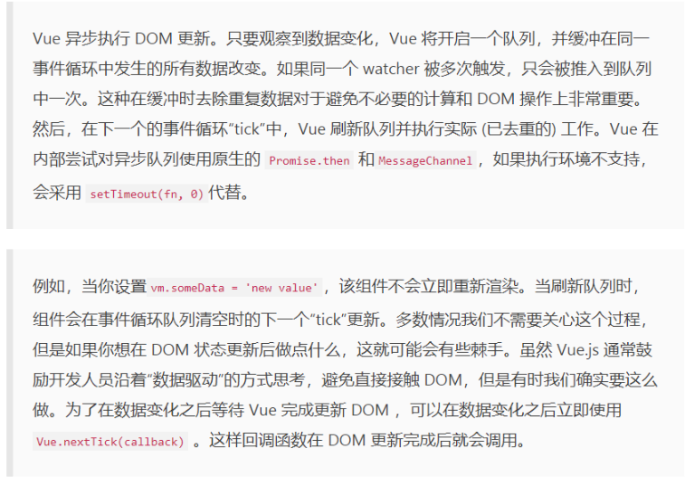

# **vue中的nextTick**

## **什么是nextTick：**
> 官网中的定义：在下次DOM更新循环结束之后执行延迟回调。在修改数据之后立即使用这个方法，获取更新之后的dom。

&emsp;&emsp;也就是获取更新后DOM的方法，所以在Vue.nextTick()回调中的执行应该是会对dom进行操作的js代码。  简单的理解是：当数据更新了，在dom渲染之后，自动执行该函数。

## **原理**

&emsp;&emsp;vue实现响应式并不是数据发生之后DOM立即变化，而是按照一定的策略进行DOM的更新。

&emsp;&emsp; **这里展开说一下vue更新dom的机制：**

* （1）、首先修改数据，这是一个同步任务。同一事件循环的所有的同步任务都在主线程上执行，形成一个执行栈，此时还没涉及dom。
* （2）、当Vue观测到数据发生改变的时候，就会开启一个异步队列，并且缓冲在此事件循环中发生的所有数据改变。如果同一个watcher被触发多次，只会被推入到队列中一次。
* （3）、官网所说的下一次循环更新，就是指，同步任务执行完毕，开始执行异步watcher队列的任务，更新DOM。Vue在内部尝试对异步队列使用原生的Promise和MessageChannel方法，如果执行环境不支持，会采用setTimeout（fn， 0）代替；
* （4）、这一步就是官网所说的下一次DOM循环结束之后。此时Vue.nextTick()就可以获取到改变之后的dom。通过setTimeout（fn，0）也是同样可以获取的。

## **什么时候需要使用到nextTick？** 
1. 如果想在created()钩子函数进行的DOM操作一定要放在vue.nextTick()的回调函数中。因为这个时候的dom其实未进行任何渲染，而此时进行dom操作是没有用的会报错。所以需要放在Vue.nextTick里面。

2. 、当项目中想在改变dom元素的数据后基于新的dom做点什么，对新dom一些列的js操作都需要放进Vue.nectTick()的回调函数里面。

3. 在使用某个第三方插件时 ，希望在vue生成的某些dom动态发生变化时重新应用该插件，也会用到该方法，这时候就需要在 $nextTick 的回调函数中执行重新应用插件的方法。

[参考一](https://blog.csdn.net/zhouzuoluo/article/details/84752280)
[参考二](https://segmentfault.com/a/1190000012861862)
    

    