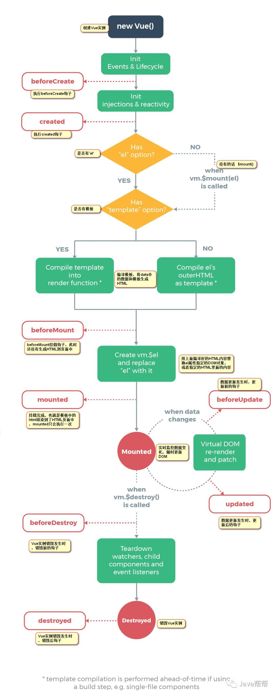

# **vue的生命周期详解**

## **创建阶段：**

1. **beforeCreate：**
   
   这个钩子函数是在实例初始化之后，数据观测（data observer）和事件配置之前被调用的。在这个时候去取data和调用method是没有用的。

2. **created：**
   
   这个钩子函数是在实例创建完之后被调用的，在这一步，实例已经完成以下配置：data数据的观测、属性和方法的运算、 watch/event 事件回调。但是这个时候，挂载阶段还没有开始，$el属性目前不可见。
   
   
   这时候是可以获取Vaue的data、调用Vue方法，获取员文本HTML上直接加载出来的DOM，但是无法获取通过挂在模板生成的DOM(如：v-for遍历循环生成的li)。也就是说dom还拿不到。

  * 主要应用：调用数据，调用方法，调用异步函数

## **挂载阶段**
1. **beforeMount：**
   
   在挂载前被调用:相关的render函数（模板）首次被调用。但是通过v-for那些指令生成的html还没有挂载到页面上来。**也就是说，dom还拿不到**

2. **Mounted：**
   
   el被新建的VM.$el替换，并且挂载到实例上去之后调用该钩子。这时候就有初始值的DOM渲染，例如我们的初始数据list渲染出来的li，在这里可以获取到。**也就是说dom可以获取到了**。
   
## **更新阶段**
1. **beforeUpdate**
   
    数据更新时调用，发生在虚拟dom重新渲染和补丁之前。你可以在钩子中进一步更改状态，这不会触发附加的重新渲染过程。当我们改变vue的任何数据后都会触发该钩子函数。

2. **updated**
   
    由于数据更改导致的虚拟DOM重新渲染和打补丁，在这之后会调用该钩子。 **该钩子在服务器端渲染期间不被调用**。

## **销毁阶段**
1. **beforeDestroy**
    实例销毁之前调用。在这一步，实例仍然完全可用。

2. **destroyed**
    Vue实例销毁之后调用。调用之后，vue实例指示的所有东西都会解绑定，所有的事件监听器会被移除，所有的子实例也会被销毁。**该钩子在服务器渲染期间不可被调用。**

## **扩展**

* 问题：vue请求数据放在created好还是mounted里好

    其实需要看是使实际情况：

    一般是放在created里面就可以了，如果需要在请求完成之后去操作dom的话，那就必须在mounted里面。

    > 1、created:在模板渲染成html前调用，即通常初始化某些属性值，然后再渲染成视图。
    >
    >2、mounted:在模板渲染成html后调用，通常是初始化页面完成后，再对html的dom节点进行一些需要的操作。

- 在created中发送请求：
    * 场景：如果首屏渲染的数据是来自于后端的话，那么在需要在这里发送请求。
    * 优点：能够更快的获取到服务端的数据，减少页面loading的时间，(但是在这里的话，如果请求时间过长的话那就出现长时间的白屏现象。)放在created中有助于一致性，因为在srr服务端渲染的时候，是不支持beforemount和mounted钩子函数的。

    
    

- 在mounted中发送请求：
    * 场景：如果需要在请求完成之后进行对dom的操作的话，那就需要在这里发送请求；

    * 在这个钩子里面请求数据的话，可能会导致页面闪屏现象。
